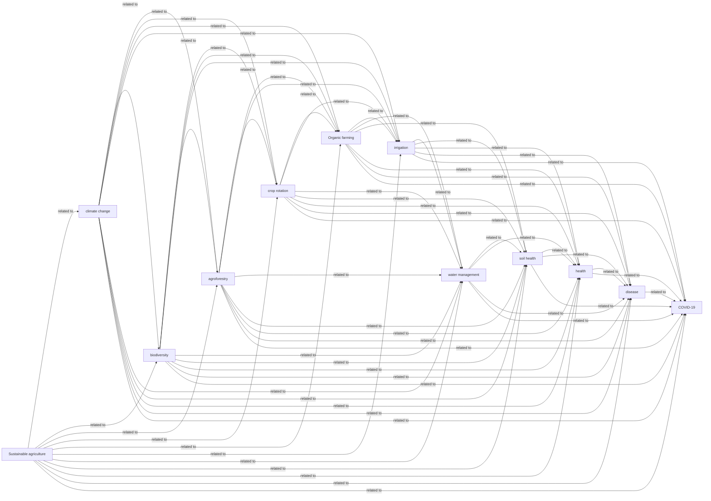

```mermaid
graph LR
    N0["Sustainable agriculture"]
    N1["climate change"]
    N2["biodiversity"]
    N3["agroforestry"]
    N4["crop rotation"]
    N5["Organic farming"]
    N6["irrigation"]
    N7["water management"]
    N8["soil health"]
    N9["health"]
    N10["disease"]
    N11["COVID-19"]
    N0 -->|"related to"| N1
    N0 -->|"related to"| N2
    N0 -->|"related to"| N3
    N0 -->|"related to"| N4
    N0 -->|"related to"| N5
    N0 -->|"related to"| N6
    N0 -->|"related to"| N7
    N0 -->|"related to"| N8
    N0 -->|"related to"| N9
    N0 -->|"related to"| N10
    N0 -->|"related to"| N11
    N1 -->|"related to"| N2
    N1 -->|"related to"| N3
    N1 -->|"related to"| N4
    N1 -->|"related to"| N5
    N1 -->|"related to"| N6
    N1 -->|"related to"| N7
    N1 -->|"related to"| N8
    N1 -->|"related to"| N9
    N1 -->|"related to"| N10
    N1 -->|"related to"| N11
    N2 -->|"related to"| N3
    N2 -->|"related to"| N4
    N2 -->|"related to"| N5
    N2 -->|"related to"| N6
    N2 -->|"related to"| N7
    N2 -->|"related to"| N8
    N2 -->|"related to"| N9
    N2 -->|"related to"| N10
    N2 -->|"related to"| N11
    N3 -->|"related to"| N4
    N3 -->|"related to"| N5
    N3 -->|"related to"| N6
    N3 -->|"related to"| N7
    N3 -->|"related to"| N8
    N3 -->|"related to"| N9
    N3 -->|"related to"| N10
    N3 -->|"related to"| N11
    N4 -->|"related to"| N5
    N4 -->|"related to"| N6
    N4 -->|"related to"| N7
    N4 -->|"related to"| N8
    N4 -->|"related to"| N9
    N4 -->|"related to"| N10
    N4 -->|"related to"| N11
    N5 -->|"related to"| N6
    N5 -->|"related to"| N7
    N5 -->|"related to"| N8
    N5 -->|"related to"| N9
    N5 -->|"related to"| N10
    N5 -->|"related to"| N11
    N6 -->|"related to"| N7
    N6 -->|"related to"| N8
    N6 -->|"related to"| N9
    N6 -->|"related to"| N10
    N6 -->|"related to"| N11
    N7 -->|"related to"| N8
    N7 -->|"related to"| N9
    N7 -->|"related to"| N10
    N7 -->|"related to"| N11
    N8 -->|"related to"| N9
    N8 -->|"related to"| N10
    N8 -->|"related to"| N11
    N9 -->|"related to"| N10
    N9 -->|"related to"| N11
    N10 -->|"related to"| N11
```
