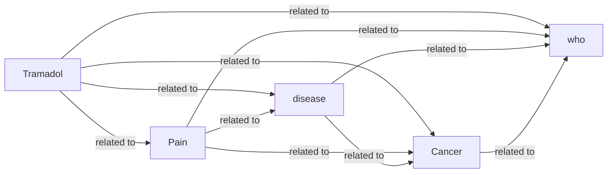

```mermaid
graph LR
    N0["Tramadol"]
    N1["Pain"]
    N2["disease"]
    N3["Cancer"]
    N4["who"]
    N0 -->|"related to"| N1
    N0 -->|"related to"| N2
    N0 -->|"related to"| N3
    N0 -->|"related to"| N4
    N1 -->|"related to"| N2
    N1 -->|"related to"| N3
    N1 -->|"related to"| N4
    N2 -->|"related to"| N3
    N2 -->|"related to"| N4
    N3 -->|"related to"| N4
```
