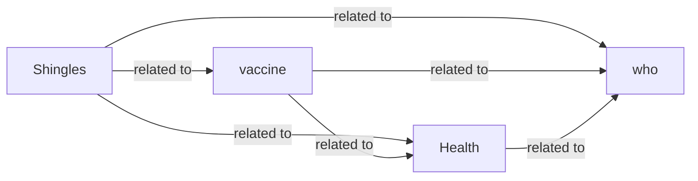

```mermaid
graph LR
    N0["Shingles"]
    N1["vaccine"]
    N2["Health"]
    N3["who"]
    N0 -->|"related to"| N1
    N0 -->|"related to"| N2
    N0 -->|"related to"| N3
    N1 -->|"related to"| N2
    N1 -->|"related to"| N3
    N2 -->|"related to"| N3
```
